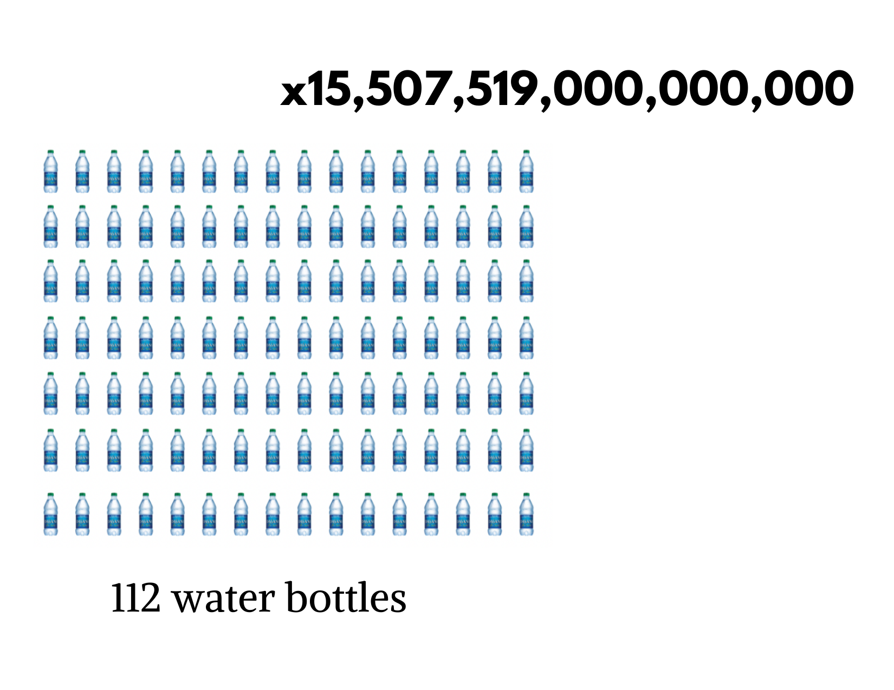
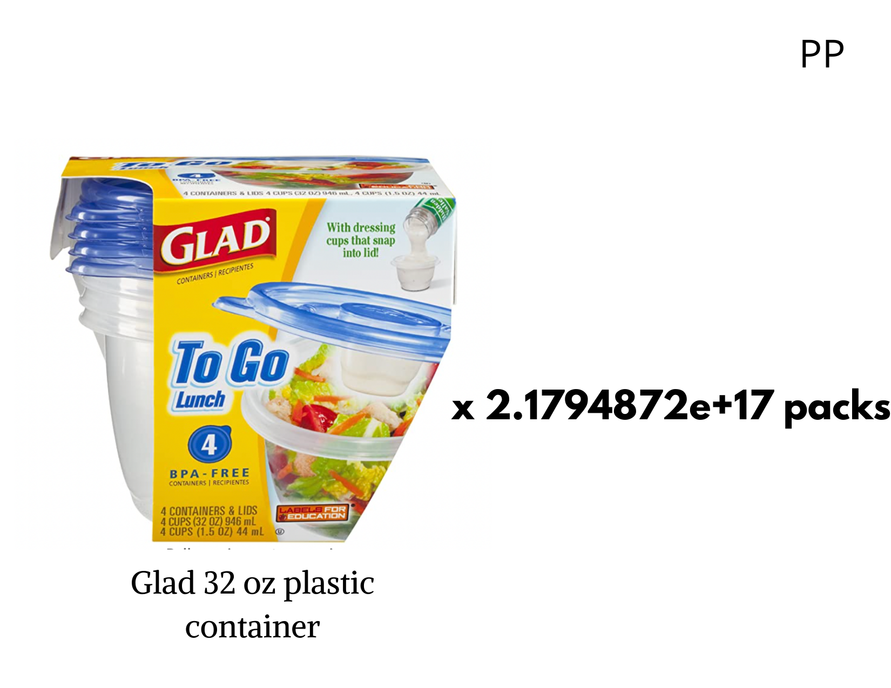
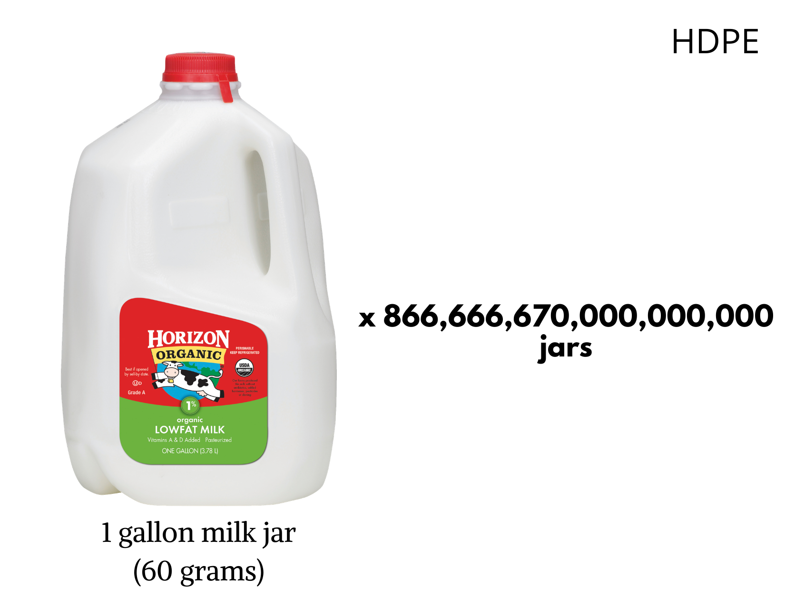
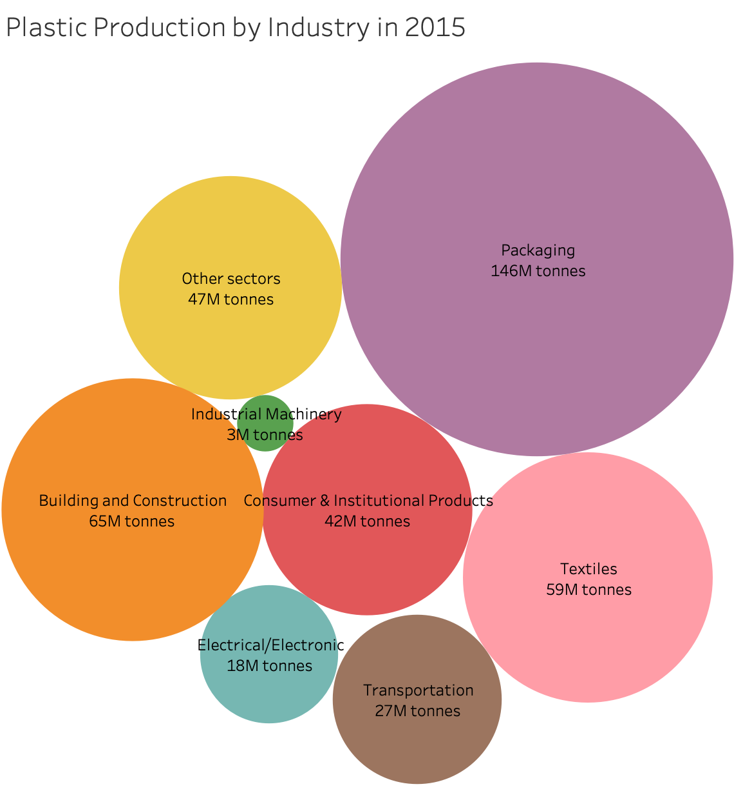
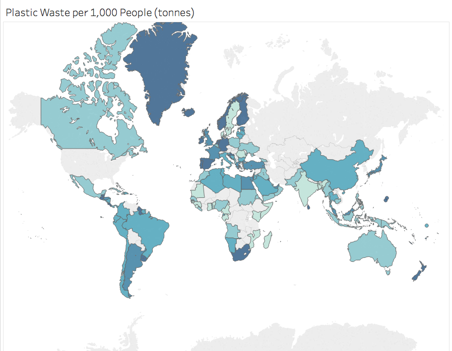
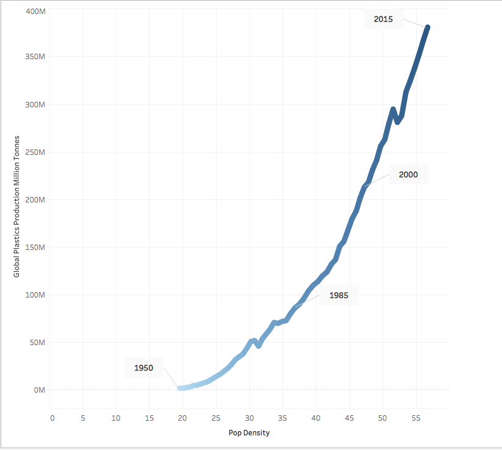
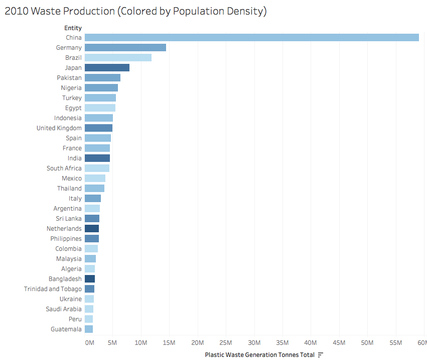
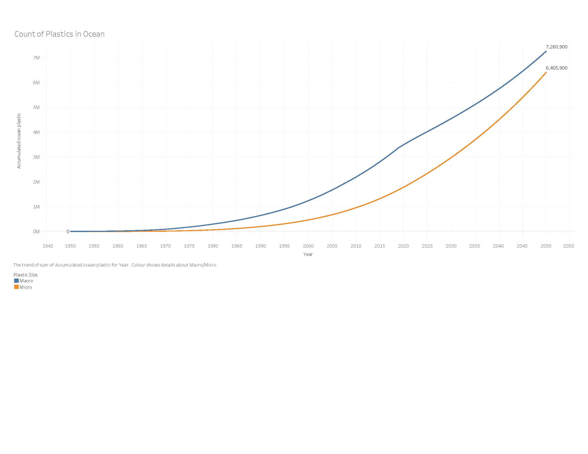
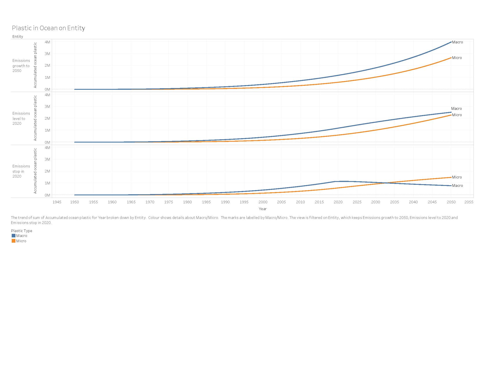

## Introduction

```{r, include=F, warning=F, message=F}
# data wrangling
library(tidyverse)
library(janitor)
library(naniar)
library(skimr)

# visualizing
library(ggdist)
library(DT)
library(patchwork)

```


```{r, include=F, message=F, warning=F}
# hello! code goes here
# this doc is combining everything
sector_polymer <- read_csv("data/plastic-production-by-sector.csv") %>% 
  clean_names()
plastics_time <- read_csv("data/global-plastics-production.csv") %>% 
  clean_names()
microp_ocean <- read_csv("data/microplastics-in-ocean.csv") %>% 
  clean_names()
macrop_ocean <- read_csv("data/macroplastics-in-ocean.csv") %>% 
  clean_names()

```

Our Final Project is guided by four questions: Where does polluting plastic come from? How much polluting plastic is there in the world and how much has there been over time? Where does the plastic end up eventually? Why should I care; i.e. where does the plastic go in my life? Each of the explored datasets below answers one of these guiding questions (two datasets are used to answer where plastic goes). **A final overview of trends of focus for our project can be found in the conclusion section of this PDF.**

## Plastics by Industrial Sector + Polymer Types

```{r, echo=FALSE}
sector_polymer %>% 
  select(-code) %>% 
  datatable()
```

### Polymer Types

The data on polymer types is documented in 2015 and it shares the dataset with the plastic consumption by industrial sectors. It includes 2 variables: the entity (type of plastic: PET, HDPE, LDPE, PET etc.) and the amount of primary plastic production in million metric tonnes. Looking at only the data for polymers, the minimum primary plastic production is 6.80e+07 million tonnes (PP) and the maximum primary plastic production is 2.50e+07 million tonnes (PS). We plan on visualizing the polymer data with the every day products to provide users a more tangible understanding of the amount of plastic production by polymer types. The figures below are several ways that we've been exploring how to visualize the data through actual products.


{width=40%}

{width=40%}

{width=40%}

{width=40%}

{width=40%}

*Note:* the visualization didn’t take into account of the complexity of the production process as data on the exact number of plastic polymer used in plastic product production process isn’t publicly available. Therefore, the visualization a rough estimate of the translation using the weight of plastic product (ex. Single- use plastic water bottle etc.) but didn’t take into account for the other materials (ex. Oil and water) used in production. 

For next steps, we plan to explore ways to visualize the data even more using metaphors such as the distance from earth to moon or the size of a continent to describe the numbers associated with each plastic product. 

```{r, echo=T, results='hide'}
skim_without_charts(sector_polymer)
```


```{r, echo=FALSE}
tibble(
  Missingness = "No Missingness",
  `Industry/Polymer Type Count` = 19,
  Year = "Only 2015",
 `Production Range` = str_c(min(sector_polymer$primary_plastic_production_million_tonnes), " to ", max(sector_polymer$primary_plastic_production_million_tonnes))
) %>% 
  datatable()
```

### Industrial Sectors

The data from 2015 on plastic production by industrial sector gave some indication of which industries are the biggest producers of plastic. The data includes 2 variables:  entity (industry/sector: packaging, textiles, transportation, building & construction, etc...) and the amount of plastic produced in million  tonnes. This data was in the same table as the polymer types data but the desired variables were separated and an initial exploratory visualization using a bubble chart was preformed. As expected, packaging was the biggest industrial producer with 146 million tonnes. The smallest producer was the industrial machinery sector with 3 million tonnes of plastic. 

{width=50%}

Although this gives some idea of where plastic is coming from, it could be useful to couple this information with the polymer types data and try a stacked bar plot.

## Production Over Time

```{r, echo=FALSE, message=F, warning=F}
#Load .csv files for relevant datafiles. 
plastics_type <- read_csv("data/global-plastics-production.csv") %>% 
  clean_names()
population_by_time <- read_csv("data/WPP2019_TotalPopulationBySex.csv")%>% 
  clean_names()
waste2010 <- read_csv("data/plastic-waste-generation-total.csv") %>% 
  clean_names()
```

**Summary of Datasets**

``` {r}
#Summarize datasets.
summary(plastics_type)
summary(population_by_time)
summary(waste2010)

```

``` {r}
#Look at top of datasets for adjusting naming convention. 
head(plastics_type) %>% 
  datatable()
head(population_by_time) %>% 
  datatable()
head(waste2010) %>% 
  datatable()

```

```{r, echo=F}
#Merge datasets. 

typevspop <- merge(plastics_type, population_by_time, by.x=c("entity", "year"), by.y= c("location", "time"))

waste_bycountry2010 <- merge(waste2010, population_by_time, by.x=c("entity", "year"), by.y= c("location", "time"))

#Generate pctfemale and pctmale. 
waste_bycountry2010$pctfemale <- waste_bycountry2010$pop_female/waste_bycountry2010$pop_total
waste_bycountry2010$pctmale <- waste_bycountry2010$pop_male/waste_bycountry2010$pop_total

typevspop$pctmale <- typevspop$pop_male/typevspop$pop_total
typevspop$pctfemale <- typevspop$pop_female/typevspop$pop_total

```

**Running Regressions on Data**

```{r, echo=FALSE}
#Run regressions. 

totpop.lm <- lm(formula = plastic_waste_generation_tonnes_total ~ pop_total, data=waste_bycountry2010)
gender.lm <- lm(formula = plastic_waste_generation_tonnes_total ~ pop_male + pop_female, data=waste_bycountry2010)
density.lm <- lm(formula = plastic_waste_generation_tonnes_total ~ pop_density, data=waste_bycountry2010)
summary(totpop.lm)
summary(gender.lm)
summary(density.lm)
```

```{r, include=F}
#Export final .csv files. 
write.csv(typevspop, "year_vs_population_plastic.csv")
write.csv(waste_bycountry2010, "waste_vs_country_2010.csv")
```

```{r, fig.height=3, fig.width=4}
# Lineplot of total plastics production over time.
ggplot(plastics_time, aes(year, global_plastics_production_million_tonnes)) + 
  geom_line() +
  labs(title= "Plastic Production by Year", x= "Year", y=" Plastic Production (in tonnes)") +
  scale_x_continuous(n.breaks=10)
```

{width=40%}

{width=40%}

{width=40%}

I used the Global Plastics Production over Time and the 2010 Plastic Production by Country datasets from Our World in Data in conjunction with 1950-2020 population breakdowns from the UN's data archive. I wanted to investigate the plastic waste:population ratio by country in 2010, as well as for the world at large from 1950 to the present I merged these datasets together and recreated a simple lineplot showing the exponential growth of world plastic production in the last few decades. I also regressed few basic population indicators on plastic production. **Interesting trends:**

* plastic waste production far outpaces population growth, particularly in recent years. 
* though total population showed a significant association with total plastic production in 2010 (which makes a lot of sense) it was surprising that the countries with the densest populations weren't necessarily the ones with the highest total plastic production. For example: India has one of the world's biggest populations but was ranked lower than Germany, Spain, and Nigeria in Total Plastic Production in 2010. I'd like to use the UN population data (which breaks countries up by development status) to investigate this finding more. The final point I intend to convey with my part of the visualization is that plastic production has grown relatively independently of raw population growth, in the sense that it is not just the world's most populous countries contributing the most to global plastic production. 

## Micro and Macroplastic Pollution in the Ocean

Both the Micro and Macroplastics Datasets are stored with the same organization. There are three categories of data: Plastic Pollution up until 2050 if emissions continue to increase at the projected rate, pollution until 2050 if the emission rate levels to the 2020 rate by 2050, and pollution until 2050 if the emissions rate levels off stop in 2020. Scroll below to see information about the data and our analyses.

### Macroplastics

```{r, echo=F}
tibble(
  `Entity` = "3 Types: Emissions Growth, Consistency, and Stop from 2020",
   Missingness = "No Missingness",
  `Number of Observations` = 303,
  Year = str_c(min(macrop_ocean$year), " to ", max(macrop_ocean$year)),
 `Plastic Count Range` = str_c(0, " to ", 3971900)
) %>% 
  datatable()
```

```{r, echo=F, fig.height=3.5, fig.width=4.5}
ggplot(macrop_ocean, aes(year,
                         accumulated_ocean_plastic_macroplastics_0_5cm,
                         color = entity)) + 
  geom_line() +
  theme_ggdist() +
  labs(
    title = "Macroplastics in Ocean",
    x = "Year",
    y = "Macroplastics (>0.5cm)",
    color = "Entity"
  )
```


### Microplastics

```{r, echo=FALSE}
tibble(
  `Entity` = "3 Types: Emissions Growth, Consistency, and Stop from 2020",
   Missingness = "No Missingness",
  `Number of Observations` = 303,
  Year = str_c(min(microp_ocean$year), " to ", max(microp_ocean$year)),
 `Plastic Count Range` = str_c(0, " to ", 2652700)
) %>% 
  datatable()

```

{width=50%}

### Macro and Microplastics Comparisons

{width=50%}

{width=50%}

In comparing Micro and Macroplastics, we discovered that there are currently more Macroplastics polluting the ocean than Microplastics. Interestingly, if plastic emissions were to stop in 2020, the number of Macroplastics is projected to drop significantly to be less than the number of Microplastics by 2050.

After generating the graphs above we reached several conclusions. Overall, for both Macro and Microplastics, the current rate of emissions is projected to lead to exponential growth in the amount of plastic pollution in the ocean. This growth is projected to curb that growth if emissions level to their 2020 levels by 2050, but the only real way to decrease the amount of ocean plastics is if emissions stop completely.

## Conclusion

Notable features we have the option to visualize are as follows:

* Translations between polymer types to more commonly understood metrics for consumers. Polymer type waste of all kinds has increased over time.
* Packaging is the biggest industrial producer with 146 million tonnes. The smallest producer was the industrial machinery sector with 3 million tonnes of plastic.
* Plastic waste production far outpaces population growth, particularly in recent years. 
* Countries with the densest populations weren't necessarily the ones with the highest total plastic production.
* Micro and Macroplastic levels in the ocean are growing at an exponential rate, and will continue to do so if pollution levels both remain at their current level and continue to grow as projected.

## Link to Github Repo (Data Files)
Proof that we did in fact write the code to present this data :-) Although many of the graphs are simply images dropped in from Tableau. All of our data has been downloaded from various downloads at this [Our World in Data](https://ourworldindata.org/plastic-pollution){target="_blank"} Page as well as some external sources as described above.

Go to the "data" folder in the below Github Repository to view the .csv files.

[https://github.com/kylierlin/Infovis_FP](https://github.com/kylierlin/Infovis_FP){target="_blank"}

