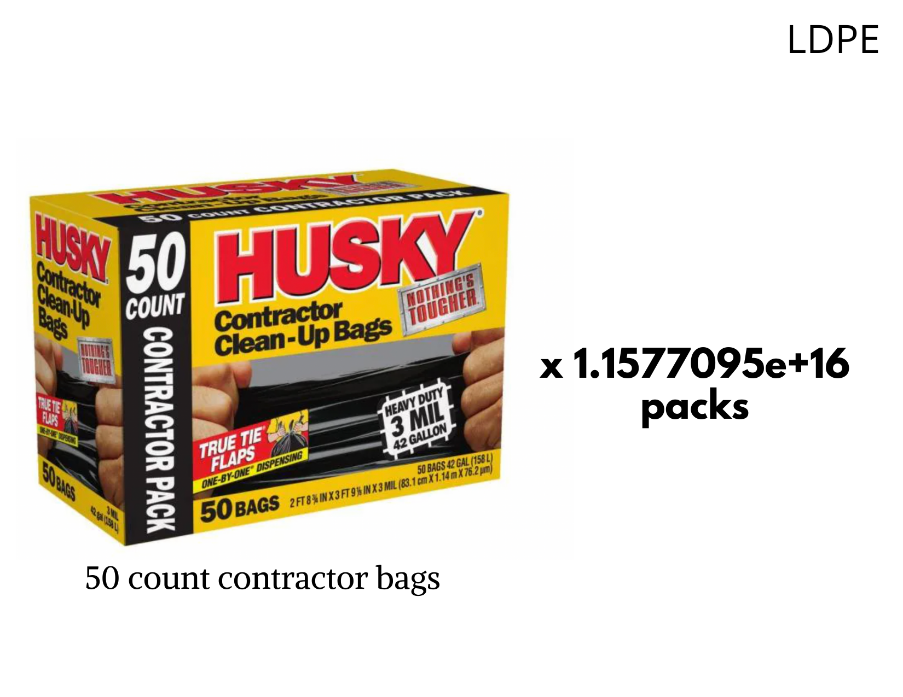

## Introduction

```{r, include=F, warning=F, message=F}
# data wrangling
library(tidyverse)
library(janitor)
library(naniar)
library(skimr)

# visualizing
library(ggdist)
library(DT)
library(patchwork)

```


```{r, include=F, message=F, warning=F}
# hello! code goes here
# this doc is combining everything
sector_polymer <- read_csv("data/plastic-production-by-sector.csv") %>% 
  clean_names()
plastics_time <- read_csv("data/global-plastics-production.csv") %>% 
  clean_names()
microp_ocean <- read_csv("data/microplastics-in-ocean.csv") %>% 
  clean_names()
macrop_ocean <- read_csv("data/macroplastics-in-ocean.csv") %>% 
  clean_names()

```

Our Final Project is guided by four questions: Where does polluting plastic come from? How much polluting plastic is there in the world and how much has there been over time? Where does the plastic end up eventually? Why should I care; i.e. where does the plastic go in my life? Each of the explored datasets below answers one of these guiding questions (two datasets are used to answer where plastic goes).

## Plastics by Industrial Sector + Polymer Types

```{r, echo=FALSE}
sector_polymer %>% 
  select(-code) %>% 
  datatable()
```

The data on polymer types is documented in 2015 and it shares the dataset with the plastic consumption by industrial sectors. It includes 2 variables: the entity (type of plastic: PET, HDPE, LDPE, PET etc.) and the amount of primary plastic production in million metric tonnes. Looking at only the data for polymers, the minimum primary plastic production is 6.80e+07 million tonnes (PP) and the maximum primary plastic production is 2.50e+07 million tonnes (PS). We plan on visualizing the polymer data with the every day products to provide users a more tangible understanding of the amount of plastic production by polymer types. The figures below are several ways that we've been exploring how to visualize the data through actual products.



*Note: the visualization didn’t take into account of the complexity of the production process as data on the exact number of plastic polymer used in plastic product production process isn’t publicly available. Therefore, the visualization a rough estimate of the translation using the weight of plastic product (ex. Single- use plastic water bottle etc.) but didn’t take into account for the other materials (ex. Oil and water) used in production. 

For next steps, we plan to explore ways to visualize the data even more using metaphors such as the distance from earth to moon or the size of a continent to describe the numbers associated with each plastic product. 

```{r, echo=T, results='hide'}
skim_without_charts(sector_polymer)
```


```{r, echo=FALSE}
tibble(
  Missingness = "No Missingness",
  `Industry/Polymer Type Count` = 19,
  Year = "Only 2015",
 `Production Range` = str_c(min(sector_polymer$primary_plastic_production_million_tonnes), " to ", max(sector_polymer$primary_plastic_production_million_tonnes))
) %>% 
  datatable()
```


## Production Over Time

```{r, include=F}
# uncomment and run this if you have trouble knitting to pdf
# tinytex::install_tinytex()
# install.packages("webshot")
# webshot::install_phantomjs()
```

```{r setup, include=FALSE}
##knitr::opts_chunk$set(echo = TRUE)
library(dplyr)
library(readr)
library(tidyverse)
# data wrangling
library(janitor)
#library(naniar)
library(skimr)

# visualizing
library(ggdist)
library(DT)
library(patchwork)

```

## Anika Data Exploration

```{r, echo=FALSE}
#Load .csv files for relevant datafiles. 
plastics_type <- read_csv("global-plastics-production.csv") %>% 
  clean_names()
population_by_time <- read_csv("WPP2019_TotalPopulationBySex.csv")%>% 
  clean_names()
waste2010 <- read_csv("plastic-waste-generation-total.csv") %>% 
  clean_names()

#Summarize datasets.
summary(plastics_type)
summary(population_by_time)
summary(waste2010)

#Look at top of datasets for adjusting naming convention. 
head(plastics_type)
head(population_by_time)
head(waste2010)

```

```{r}
#Merge datasets. 

typevspop <- merge(plastics_type, population_by_time, by.x=c("entity", "year"), by.y= c("location", "time"))

waste_bycountry2010 <- merge(waste2010, population_by_time, by.x=c("entity", "year"), by.y= c("location", "time"))

#Generate pctfemale and pctmale. 
waste_bycountry2010$pctfemale <- waste_bycountry2010$pop_female/waste_bycountry2010$pop_total
waste_bycountry2010$pctmale <- waste_bycountry2010$pop_male/waste_bycountry2010$pop_total

typevspop$pctmale <- typevspop$pop_male/typevspop$pop_total
typevspop$pctfemale <- typevspop$pop_female/typevspop$pop_total

```

```{r}
# year span
tibble(
  Missingness = "No Missingness",
  `Number of Years` = 66,
  `Year Range` = str_c(min(plastics_time$year), " to ", max(plastics_time$year)),
  `Plastics Range` = str_c(min(plastics_time$global_plastics_production_million_tonnes), " to ", max(plastics_time$global_plastics_production_million_tonnes))
) %>% 
  datatable()
```

```{r, echo=FALSE}
#Run regressions. 

totpop.lm <- lm(formula = plastic_waste_generation_tonnes_total ~ pop_total, data=waste_bycountry2010)
gender.lm <- lm(formula = plastic_waste_generation_tonnes_total ~ pop_male + pop_female, data=waste_bycountry2010)
density.lm <- lm(formula = plastic_waste_generation_tonnes_total ~ pop_density, data=waste_bycountry2010)
summary(totpop.lm)
summary(gender.lm)
summary(density.lm)
```

```{r}
#Export final .csv files. 
write.csv(typevspop, "year_vs_population_plastic.csv")
write.csv(waste_bycountry2010, "waste_vs_country_2010.csv")
```

```{r}
#Lineplot of total plastics production over time.
ggplot(plastics_time, aes(year, global_plastics_production_million_tonnes)) + 
  geom_line() +
  labs(title= "Plastic Production by Year", x= "Year", y=" Plastic Production (in tonnes)") +
  scale_x_continuous(n.breaks=10)
```


I used the Global Plastics Production over Time and the 2010 Plastic Production by Country datasets  from Our World in Data in conjuction with 1950-2020 population breakdowns from the UN's data archive. I wanted to investigate the plastic waste:population ratio by country in 2010, as well as for the world at large from 1950 to the present I merged these datasets together and recreated a simple lineplot showing the exponential growth of world plastic production in the last few decades. I also regressed  few basic population indicators on plastic production. 
Some interesting trends that I noticed:
1. plastic waste production far outpaces population growth, particularly in recent years. 
2. though total population showed a significant association with total plastic production in 2010 (which makes a lot of sense) it was surprising that the countries with the densest populations weren't necessarily the ones with the higest total plastic production 
  for example: India has one of the world's biggest populations but was ranked lower than Germany, Spain, and Nigeria in Total Plastic Production in 2010. I'd like to use the UN population data (which breaks countries up by development status) to investigate this finding more. The final point I intend to convey with my part of the visualization is that plastic production has grown relatively independently of raw population growth, in the sense that it is not just the world's most populous countries contributing the most to global plastic production. 

## Micro and Macro Plastic Pollution in the Ocean

### Macro Plastics

```{r}

```

### Micro Plastics

```{r, echo=FALSE}
tibble(
   Missingness = "No Missingness",
  `Number of Observations` = 303,
  Year = str_c(min(microp_ocean$year), " to ", max(microp_ocean$year)),
 `Plastic Count Range` = str_c(0, " to ", 2652700)
) %>% 
  datatable()

```


