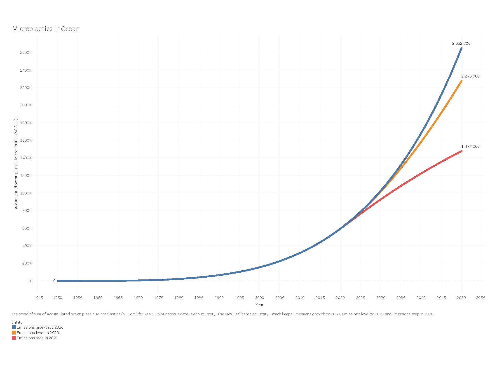

```{r, include=F}
# uncomment and run this if you have trouble knitting to pdf
# tinytex::install_tinytex()
# install.packages("webshot")
# webshot::install_phantomjs()

```

```{r,include=F, message=F, warning=F}
# data wrangling
library(tidyverse)
library(janitor)
library(naniar)
library(skimr)

# visualizing
library(ggdist)
library(DT)
library(patchwork)

```

## Mackenzie Data Exploration

```{r, message=F, warning=F}
# Reading in Data
microp_ocean <- read_csv("data/microplastics-in-ocean.csv") %>% 
  clean_names()
```


<br>

## Basic Information

```{r}
microp_ocean %>% 
  select(-code) %>% 
  datatable()
```


```{r}
skim_without_charts(microp_ocean)

```

<br>

```{r}
tibble(
   Missingness = "No Missingness",
  `Number of Observations` = 303,
  Year = str_c(min(microp_ocean$year), " to ", max(microp_ocean$year)),
 `Plastic Count Range` = str_c(0, " to ", 2652700)
)
```

```{r}



```
