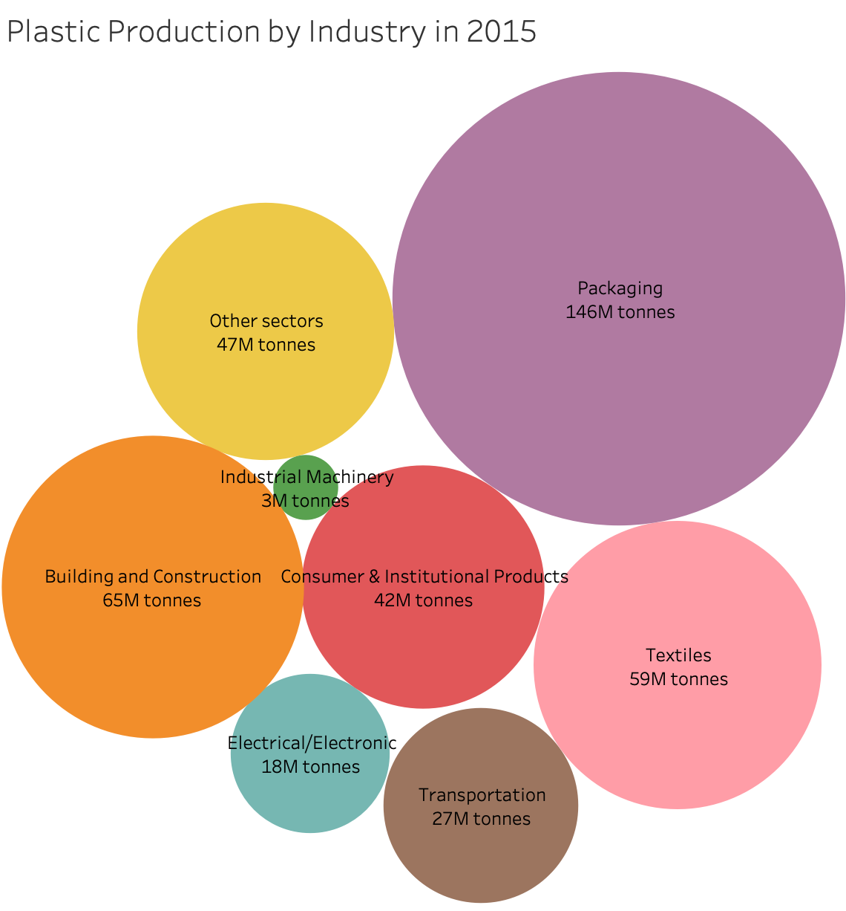

```{r, include=F}
# uncomment and run this if you have trouble knitting to pdf
# tinytex::install_tinytex()
# install.packages("webshot")
# webshot::install_phantomjs()

```

```{r,include=F, message=F, warning=F}
# data wrangling
library(tidyverse)
library(janitor)
library(naniar)
library(skimr)

# visualizing
library(ggdist)
library(DT)
library(patchwork)

```

## Nawar Data Exploration

```{r}
# Reading in Data
plastics_sector <- read_csv("data/plastic-production-by-sector.csv") %>% 
  clean_names()

```


<br>

## Basic Information

```{r}
plastics_sector %>% 
  select(-c(code)) %>% 
  datatable()
```


```{r}
skim_without_charts(plastics_sector)
```


```{r}
tibble(
  Missingness = "No Missingness",
  `Number of Industries` = 19,
  Year = "Only 2015",
 `Production Range` = str_c(min(plastics_sector$primary_plastic_production_million_tonnes), " to ", max(plastics_sector$primary_plastic_production_million_tonnes))
) %>% 
  datatable()
```


